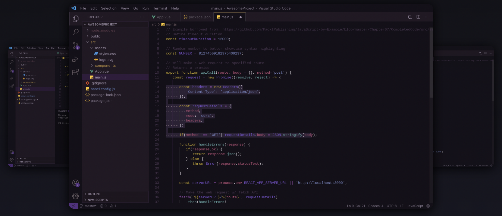
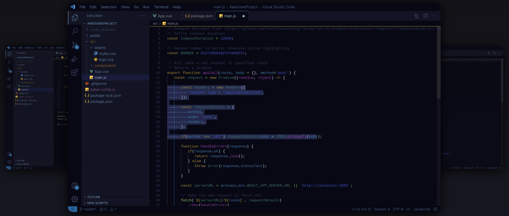
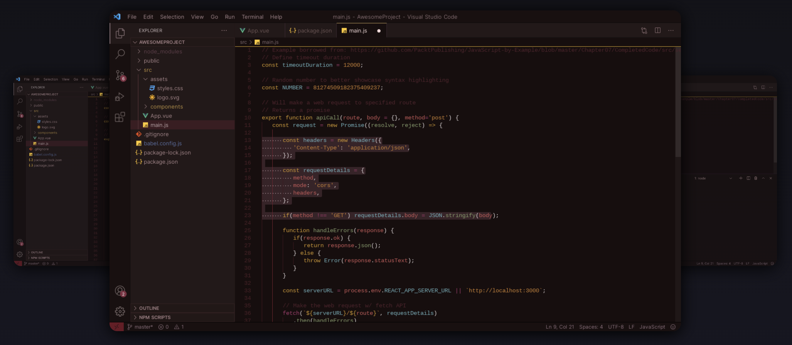
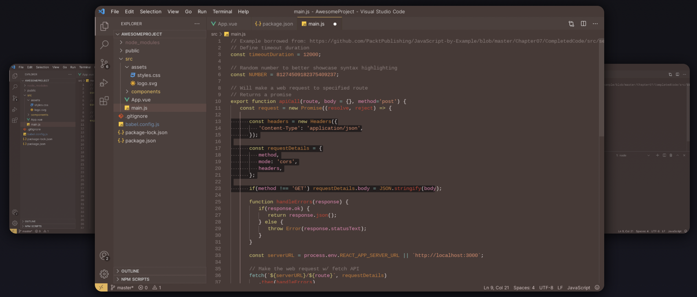
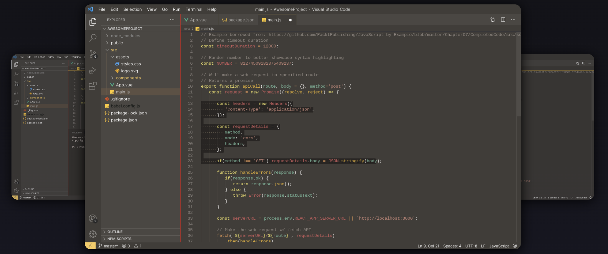

# [VS Code Plum Good Theme](https://marketplace.visualstudio.com/items?itemName=brennacodes.plum-good-theme)

This theme was created with a focus of being easy on the eyes, while also being easy to read (and cool looking).

*Now with more plum goodness!!!*

To select a theme, find the theme name in the command palette (Ctrl+Shift+P) and select it.  
Theme names are listed along with each image below.

<figure>
  
  <figcaption align = "center"><b>Plum Great Theme</b> (PG-Plum Great)</figcaption>
</figure>

<figure>
  
  <figcaption align = "center"><b>Blue Moon Theme</b> (PG-Blue Moon)</figcaption>
</figure>

<figure>
  
  <figcaption align = "center"><b>Ruby Soho Theme</b> (PG-Ruby Soho)</figcaption>
</figure>

<figure>
  
  <figcaption align = "center"><b>Red Clay Theme</b> (PG-Red Clay)</figcaption>
</figure>

<figure>
  
  <figcaption align = "center"><b>Mud Puddle Theme</b> (PG-Mud Puddle)</figcaption>
</figure>

## Install

Follow the instructions in the [marketplace](https://marketplace.visualstudio.com/items?itemName=brennacodes.plum-good-theme) or install directly from the editor:

Press `Ctrl+Shift+P` (or `Cmd+Shift+P`)   
Select `Extensions: Install Extensions`  
Search for `Plum Good`  

## Activate

With VS Code open:  
Press `Ctrl+Shift+P` (or `Cmd+Shift+P`) 
Select `Preferences: Color Theme`  
Select `PG-Original`(or `PG-Ruby Soho`, `PG-Blue Moon`, or `PG-Mud Puddle`)

## Contributing
```
cd ~/.vscode/extensions
git clone https://github.com/brennacodes/plum_good_theme 
```